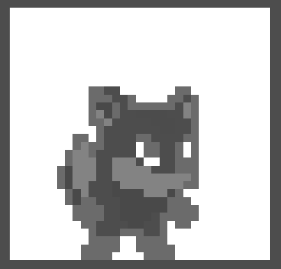
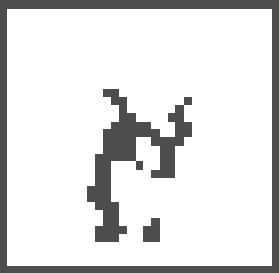

# Colour replacement shader

This shader allow us to replace and specific colour from a 2D sprite.

The shader has two uniforms, one for the `color_to_replace` and one for `color_replacement` (new colour).

1. Let's extract the brightness from the sprite.

```gdshader
shader_type canvas_item;

uniform vec4 color_to_replace: source_color;
uniform vec4 color_replacement: source_color;

void fragment() {
	// Get brightness from the remaining colours
	float brightness = length(COLOR - color_to_replace);

	// Use brightness
	COLOR = vec4(brightness);
}
```

<details>
<summary>Preview</summary>
	


</details>

2. Now let's create a mask for which colours (pixels) to replace.

```gdshader
shader_type canvas_item;

uniform vec4 color_to_replace: source_color;
uniform vec4 color_replacement: source_color;

void fragment() {
	// Get brightness from the remaining colours
	float brightness = length(COLOR - color_to_replace);

	// Create mask for 
	float mask = step(0.01, brightness);

	// Use mask
	COLOR = vec4(mask);
}
```

<details>
<summary>Preview</summary>
	


</details>

3. Let's remove the mask from the original sprite.

```gdshader
shader_type canvas_item;

uniform vec4 color_to_replace: source_color;
uniform vec4 color_replacement: source_color;

void fragment() {
	// Get brightness from the remaining colours
	float brightness = length(COLOR - color_to_replace);
	float mask = step(0.01, brightness);
	
	vec4 left = COLOR * mask;

	// Use remaining
	COLOR = vec4(left);
}
```

<details>
<summary>Preview</summary>
	


</details>

4. Finally the mask can be used to remove the masked pixels from the final sprite.

```gdshader
shader_type canvas_item;

uniform vec4 color_to_replace: source_color;
uniform vec4 color_replacement: source_color;

void fragment() {
	// Get brightness from the remaining colours
	float brightness = length(COLOR - color_to_replace);
	float mask = step(0.01, brightness);
	
	vec4 left = COLOR * mask;
	vec4 new = vec4(1.0 - mask) * color_replacement;
	
	COLOR = new + left;
}
```

<details>
<summary>Preview</summary>


</details>